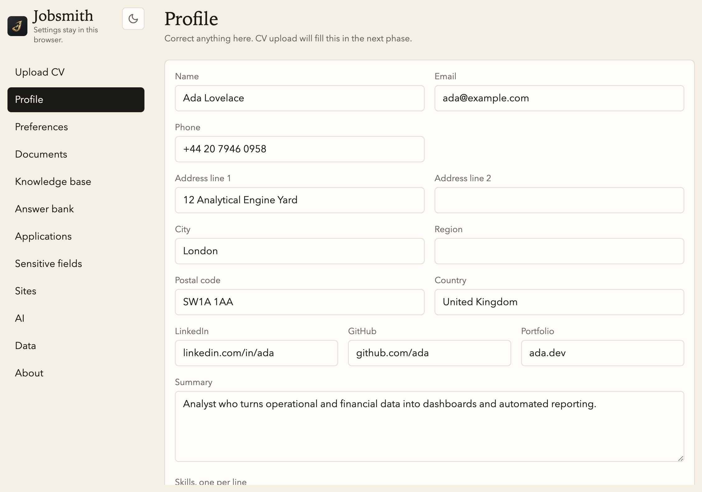
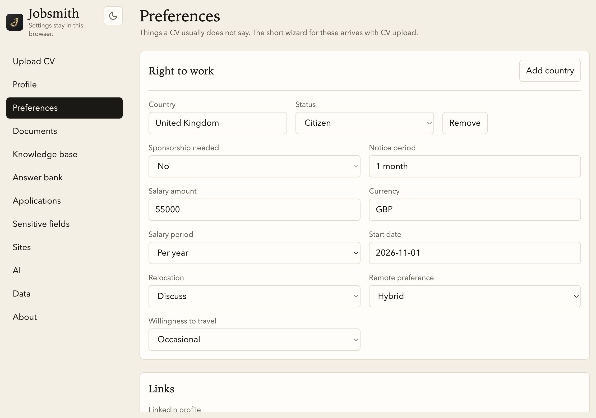
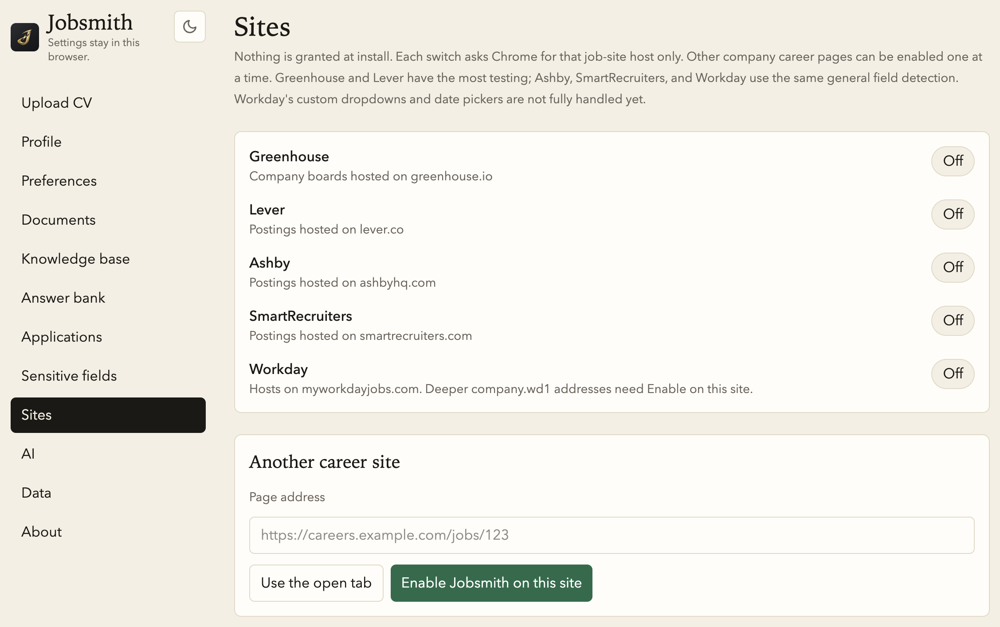
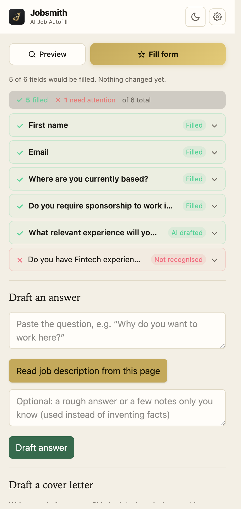

# Jobsmith

**Fill real job applications from a CV that stays in the browser.**

Jobsmith is a Chrome extension for people applying to a lot of roles. It reads a CV, keeps a profile and preferences on the device, and fills the forms those applications actually ask — name, location, sponsorship, notice period, right to work, and the long questions that need a written answer. There is no Jobsmith account and no Jobsmith server. The only network call is the one you choose to make to OpenAI with your own API key.


## Overview

A job application is a pile of repeated questions with a few that actually matter. Jobsmith treats them differently.

Structured fields — name, email, city, salary, sponsorship, right to work — come from the profile and preferences you already saved. Open questions — "what will you bring to the team?", "tell us a fun fact" — are drafted from the CV and the job description on the page, then shown for you to edit. Yes/no questions that have no saved fact are left blank until you answer them once; Jobsmith then asks if it should remember that answer for next time.

Nothing is submitted for you. Fill writes into empty fields. You review the page and press the company's own Submit button.

Screenshots below are the real Options page and side panel, loaded with a demo profile (Ada Lovelace), not a live applicant.

## Screenshots

**Profile, kept in this browser.** Upload a PDF or DOCX CV and Jobsmith parses it into this screen so you can correct it before anything is filled.



**Preferences the CV usually does not contain.** Notice period, salary, sponsorship, relocation, and where you have the right to work.



**Sites are off until you turn one on.** Greenhouse, Lever, Ashby, SmartRecruiters, and Workday each ask Chrome for that host only. Any other careers page can be enabled from the tab you are on. LinkedIn stays off.



**The side panel on an application.** Preview shows what would be filled and why. Fill is the only action that writes to the page. Green is filled, including answers drafted from the CV. Red is left for you.



## How it works

1. **Upload a CV.** Text is extracted locally (PDF via pdf.js, DOCX via mammoth). Only that text is sent to OpenAI, and only to turn it into a structured profile you then review.
2. **Set the facts a CV does not state.** Notice period, salary, start date, sponsorship, relocation, remote preference, travel, and right to work live in Preferences.
3. **Open an application and allow that site.** The toolbar icon opens the side panel. Jobsmith does not run on a host you have not allowed, and it refuses LinkedIn even if a permission exists.
4. **Preview, then fill.** Preview runs the same matching as Fill and changes nothing. Fill writes only into empty fields. Undo puts back what was there before that fill.
5. **Edit anything that is wrong.** Leaving a field, or picking Yes or No yourself, offers to save that question and answer for this site and for similar questions later.

Matching runs in layers, and a later layer only sees what the earlier ones could not answer:

| Layer | What it does |
| --- | --- |
| Heuristics | Synonyms, autocomplete, and labels. "Where are you currently based?" maps to your city. The longest matching synonym wins, so address line 2 is not filled with line 1. |
| Answer bank | A saved answer to a similar question, matched locally. No network call. |
| Field mapping | The model may map a leftover field to a profile key. It sees labels and option text, not your values, and a mapping is used only when the model marks it confident. |
| Agent reasoning | For a yes/no or short field that still has no match, the model may answer from the profile when it is confident. It does not invent a fact that is not there. |
| Draft | Long questions are written from the CV, your notes, and the job description on the page. A second pass flags claims that are not in the CV or notes. |

Dropdowns and radios resolve with the same rule everywhere: exact text, then a known alias, then a numeric range ("29" into "25–34", "50000" into "£40,000 – £50,000"). If the match is weak, or the number sits in more than one range, the field is left blank.

## How it's built

Jobsmith is a Manifest V3 extension. The content script, the side panel, and the options page are separate surfaces. They talk with typed messages, checked with Zod, so a bad payload is dropped instead of half-applied.

```text
job page (content script)
    detect fields, fill, undo, save-answer banner
        │  chrome.runtime messages
        ▼
background service worker
    OpenAI calls, answer bank, application log, CV file
        │
        ▼
options page + side panel
    profile, preferences, preview, drafts
```

| Piece | Role |
| --- | --- |
| Content script | Finds inputs, selects, radios, textareas, and common ARIA comboboxes. Fills them. Never clicks Submit, Next, or a CAPTCHA. |
| Background | Holds the OpenAI key. Parses the CV, maps fields, drafts answers and cover letters, and writes the local application log. |
| Options | Profile, preferences, sensitive defaults, sites, answer bank, documents, knowledge base, and export. |
| Side panel | Preview, Fill, Undo, per-field overrides, answer drafts, and cover letters. |
| Storage | `chrome.storage.local` for the profile and settings. IndexedDB (Dexie) for documents, the answer bank, and applications. Sensitive values can be encrypted with a passphrase that lives only in `chrome.storage.session`. |

The stack is TypeScript, React, Tailwind, WXT, Zod, Dexie, pdf.js, and mammoth. Tests run in Vitest against the detection and fill logic, including Greenhouse and Lever fixture pages. Those fixtures are representative markup, not captured live boards, so a passing test is a check of the matcher, not a promise about every live ATS layout.

Default models, both editable in Settings → AI:

- `gpt-6-luna` for parsing, field mapping, and answers
- `gpt-6.1-sol` when Better quality is on

## What it never does

- Clicks Submit, Next, or any other control that moves the application forward.
- Touches a CAPTCHA.
- Runs on LinkedIn or `lnkd.in`.
- Sends gender, ethnicity, disability, veteran status, sexual orientation, religion, or date of birth to the model, or guesses them.
- Invents an employer, a number, or a skill that is not in the CV or in notes you typed.
- Logs CV text or drafted answers in a production build.

## Run it

```sh
npm install
npm test
npm run dev
```

In Chrome, open `chrome://extensions`, turn on Developer mode, and load the unpacked extension from `.output/chrome-mv3-dev`. `npm run build` writes a production build to `.output/chrome-mv3`. `npm run zip` packs it.

Open the extension's options page to upload a CV and review the profile. The toolbar icon opens the side panel on the job page you are applying from.

## Permissions

| Permission | Why |
| --- | --- |
| `storage` | Profile, preferences, sensitive-field defaults, and settings in this browser. |
| `scripting` | Injects the content script that detects and fills fields, only on a site you have allowed. |
| `sidePanel` | The panel with preview, fill, undo, and drafts. |
| `activeTab` | Reads the tab you are using when you click "Enable Jobsmith on this site". |
| `https://api.openai.com/*` | Your key calls OpenAI from the background service worker. This host is not a browsing site. |

Site access is not granted at install. `optional_host_permissions` includes `<all_urls>` only because Chrome requires that list before it will show a runtime prompt. Jobsmith never requests `<all_urls>` itself. Each site switch requests one host pattern, such as `https://*.greenhouse.io/*`.

Not requested: `tabs`, `webRequest`, or a blanket host grant.
